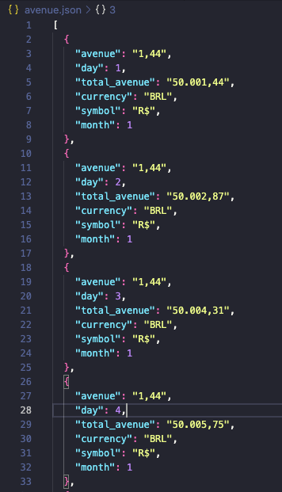

# Calculadora de Juros Compostos

## O que é?
A aplicação é uma calculadora de juros compostos diários, no qual irá pegar o juros anual, e irá fazer simulaões de valores a serem recebidos diariamente, e serão somados a cada cálculo(dia)

## Como executar?
Para executar é simples, basta ter o python 2.7 ou maior instalado em sua máquina, e executar o seguinte comando:

```bash
$ python main.py
```

Após ter rodado o comando acima, ele irá perguntar:
- A quantidade de dinheiro que você tem interesse em simular
- A quantidade de meses que você tem interesse em simular

O valor do juros está fixado via código, com o valor de 13.25, porém, poderá passar um valor de juros diferente,
passando o valor do juros após o nome do arquivo, como demonstra o exemplo a baixo:

```bash
$ python main.py 6.25
```

Após ter feito com sucesso sua simulação, será printado no terminal o valor do primeiro juros recebido, e também, será printado o valor do último juros recebido.

Além de ser criado um arquivo `json` com os dados de cada simulação diária, conforme mostra o print a baixo:



Os dados serão constituídos de:
```json
{
  "avenue": "1,00", // Valor em reais do dinheiro diário gerado pelos juros 
  "day": 1, // O dia no qual se baseia a simulação
  "total_avenue": "50.001,44", // A soma do valor total do dinheiro já ganho + o rendimento do dia
  "currency": "BRL", // A moeda utilizada
  "symbol": "R$", // O símbolo da moeda utilizada
  "month": 1 // O mês da simulação(1 mês possui 21 dias úteis para essa conta)
}
```

## Observações

Na conta realizada, é considerado 1 mês tendo 21 dias, pois são as quantidades de dias úteis em média, que 1 mês tem, no qual funciona o sistema bancário para pagamento dos juros.
